# 数据接入使用手册

## 部署dataexchage

导入表后新增数据源默认配置数据

## 创建数据源

### 创建输入源(以http为例)

1. 打开数据源配置页面，点击新增

   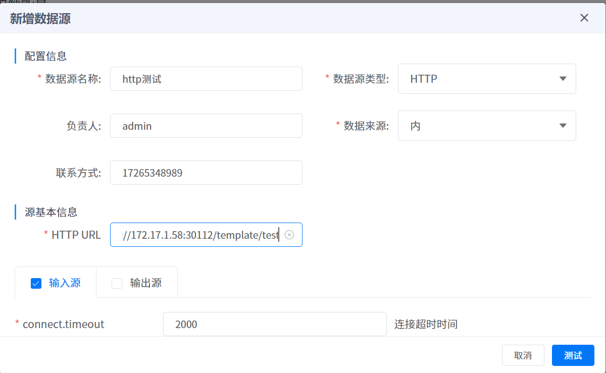

2. 选择数据类型后，在下面填入必填的配置项，也可以增加自定义配置项

   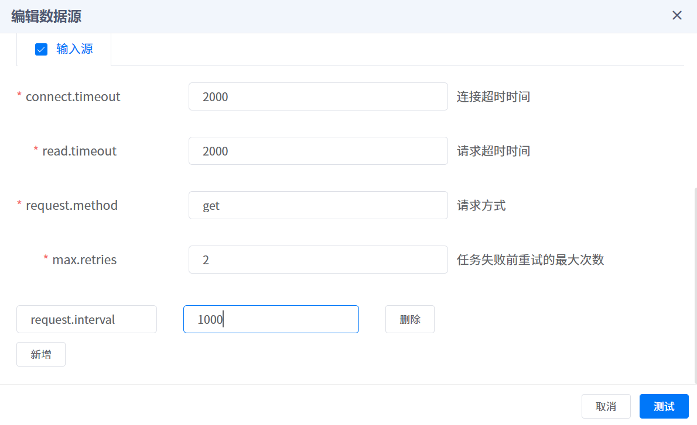

3. 点击测试，测试通过后即可保存，如不通过，请检查配置项是否写错。

### 创建输出源(以http为例)

1. 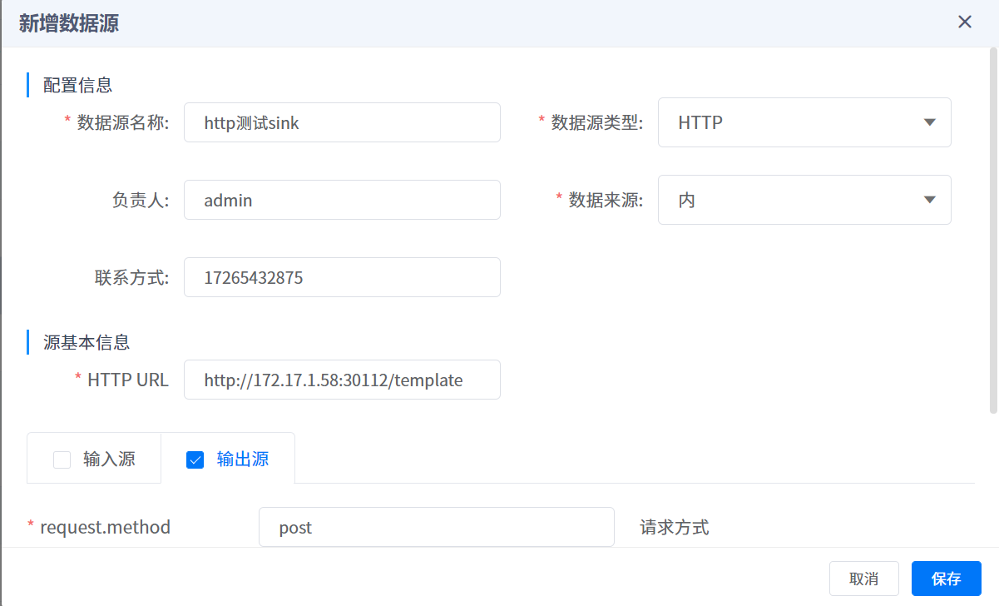

2. 在配置项勾选输出源，编辑输出源配置

   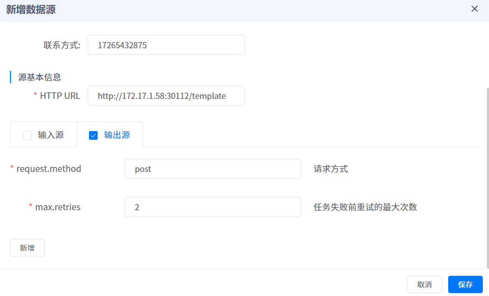

3. 也可以新增自定义配置

4. 测试通过后保存

### 一次性创建输入和输出源

此场景应用于**源基本信息**可以共用的情况下

同时勾选输入源和输出源

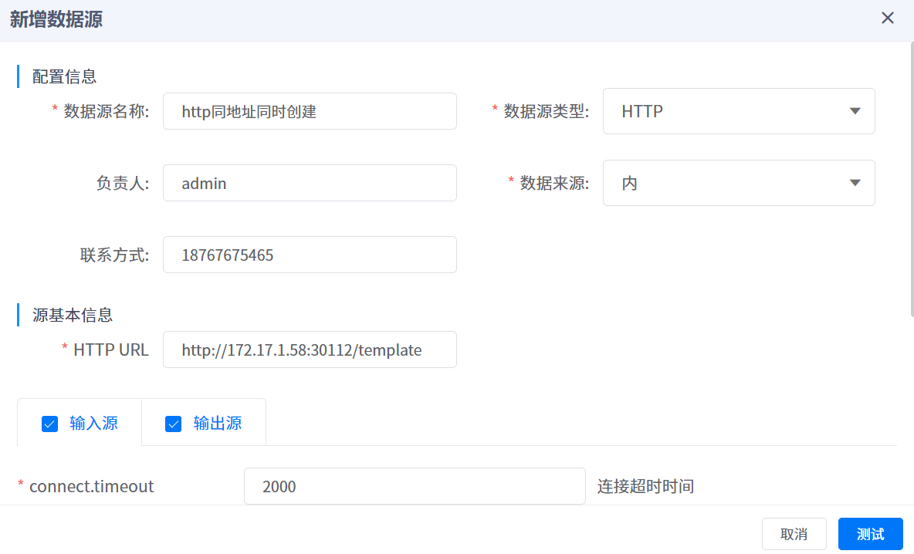

## 创建链路

### 配置阈值

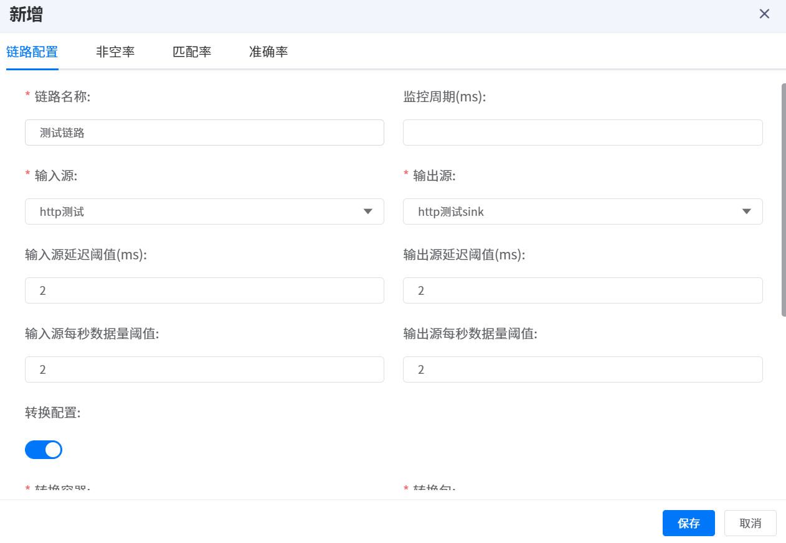

1. 填写链路名称（唯一）
2. 选择刚刚添加的输入源和输出源
3. 配置阈值
   + 输入源延迟阈值(ms)：指source阶段数据的延迟超过此阈值则会告警
   + 输入源每秒数据量阈值：指source阶段每秒的数据量低于此阈值会告警
   + 输出源同理

### 选择转换包

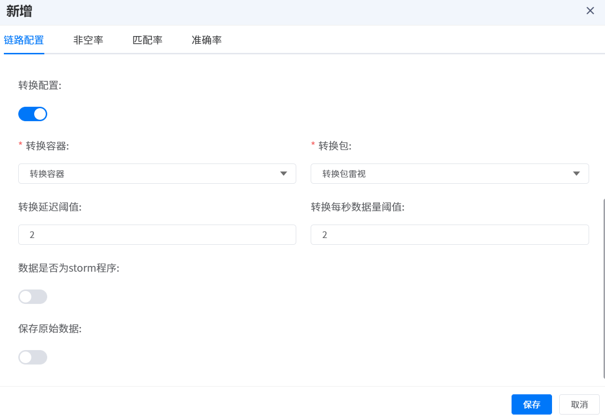

1. 如需要将数据转化则添加转化配置
2. 选择转换容器
3. 选择对应的转换包（在算法平台上传）
4. 配置阈值
   + 转换延迟阈值：转换阶段的延迟超过此阈值则告警
   + 转换每秒数据量阈值：转换阶段每秒的数据量低于此阈值则告警

### 如果为storm程序

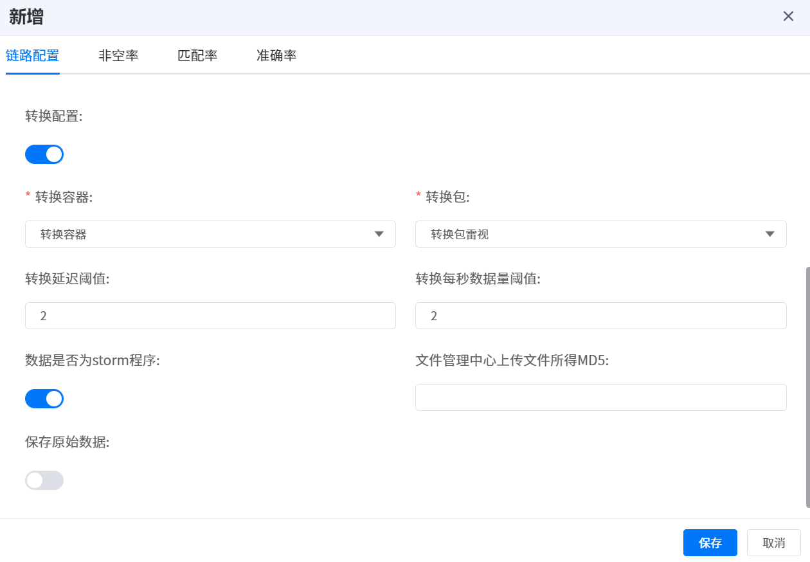

1. 如果选择storm程序，则输入文件上传所得的MD5值

### 配置数据质量（可选）

配置数据质量监控，两小时统计一次

#### 非空率

指所配字段不为空的概率

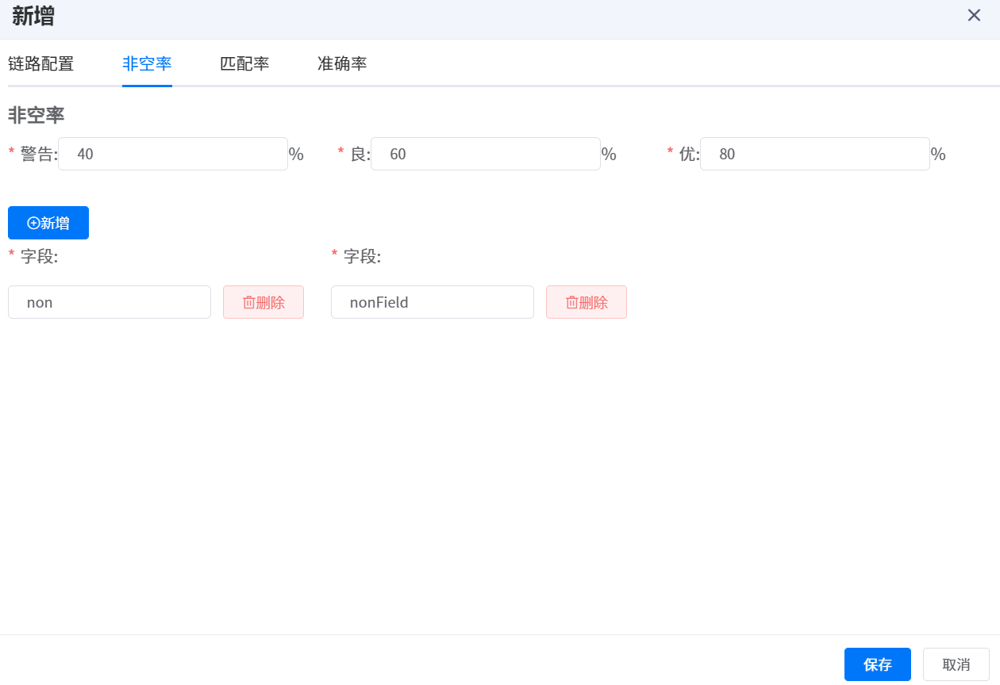

1. 首先配置告警级别
2. 配置需要检测的字段

#### 匹配率

指所配字段的对应的正则匹配率

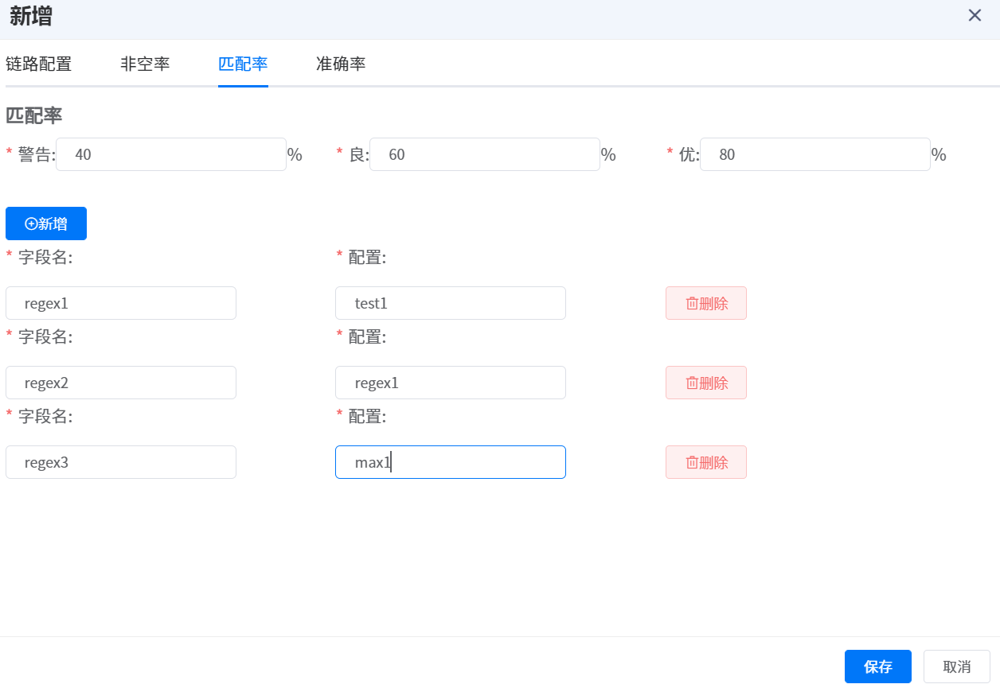

1. 配置告警级别
2. 配置字段和对应的正则表达式

#### 准确率

指的是所配字段是否存在于所配的区间内的比例

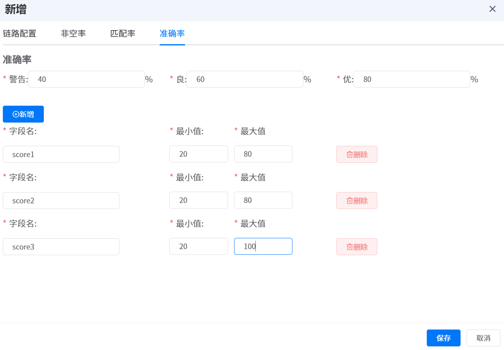

1. 配置告警级别
2. 配置字段和对应的区间

## 查看监控信息

### 链路心跳

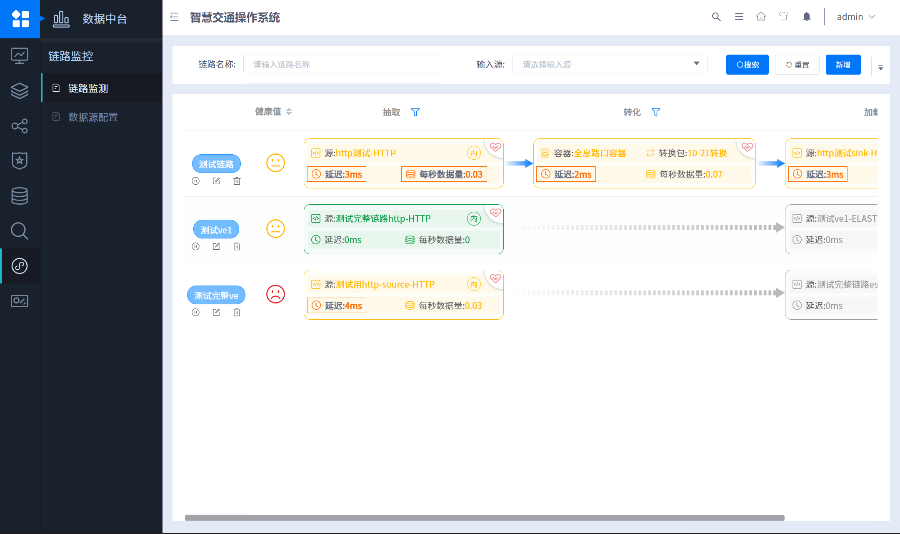

双击指定的链路进入详情页

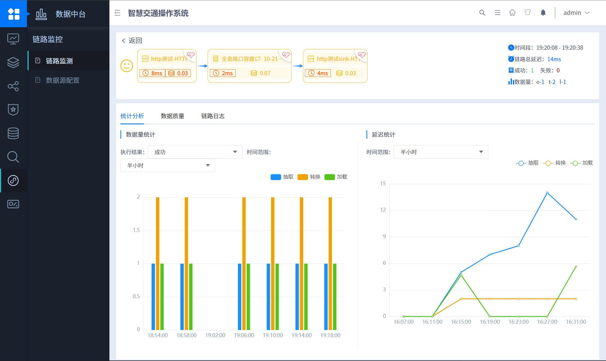

上方左半部分指三个阶段的心跳检测和健康值检测（根据创建链路时所配置的阈值），右半部分显示的是一段时间内（可配置）链路的传输情况。

### 数据质量

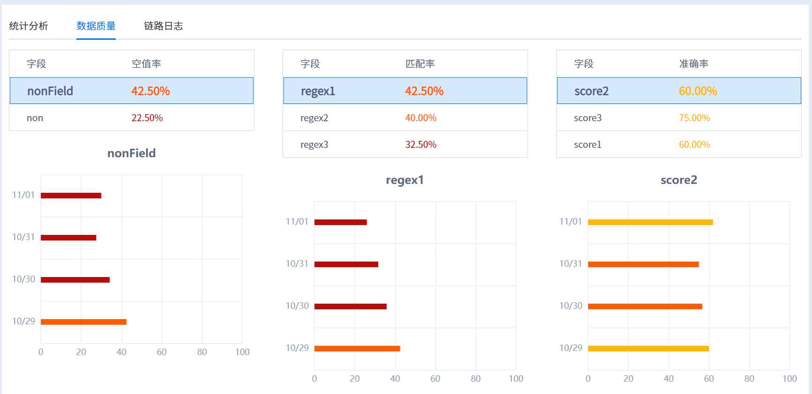

显示最近一周的数据质量监控情况

1. 绿色：优以上
2. 黄色：良到优
3. 橙色：警告到良
4. 红色：警告以下

### 链路日志

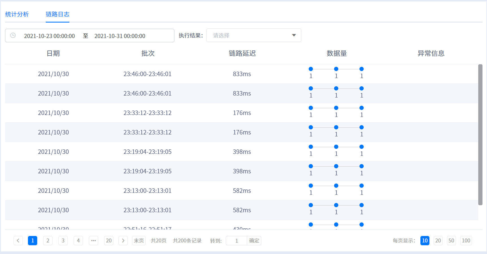

## 配置链路示例

### source任务

#### JMS

+ 单机模式

ActiveMQ(JNDI)案例

```properties
# connector.class=io.macronova.kafka.connect.jms.JmsSourceConnector
jndi.connection.factory=ConnectionFactory
max.poll.records=100
tasks.max=1
topics=from-jms-queue
java.naming.factory.initial=org.apache.activemq.jndi.ActiveMQInitialContextFactory
java.naming.provider.url=tcp://host:61616 (port)
# dynamicQueuesyy
jms.destination.name=dynamicQueues/queueToKafka
max.retries=100
bootstrap.servers=cloud-kafka:9092
retry.backoff.ms=60000
jms.username=admin
poll.timeout.ms=1000
# JNDI服务器用户名
java.naming.security.principal=admin
# JNDI服务器密码
java.naming.security.credentials=admin
value.converter.schemas.enable=false
jms.password=admin
jms.destination.type=queue
value.converter=org.apache.kafka.connect.json.JsonConverter
key.converter=org.apache.kafka.connect.storage.StringConverter
jms.message.converter=io.macronova.kafka.connect.jms.common.StandardJmsConverter
```

#### DATABASE

```properties
connection.url=jdbc:mysql://53.26.5.171:3306/itp_sync_mz?useUnicode=true&characterEncoding=UTF-8&serverTimezone=Asia/Shanghai
connection.user=root
connection.password=supconit
# bulk 会持续将拉取所有的数据
# incrementing 在每个表上使用严格递增的列来仅检测新行。 不会检测对现有行的update和delete。
mode=incrementing
query=SELECT * FROM TABLE_NAME
# 轮询每个表中新数据的频率（以毫秒为单位）
poll.interval.ms=5000
# 时区
db.timezone=Asia/Shanghai
connector.class=io.confluent.connect.jdbc.JdbcSourceConnector
validate.non.null=false
# 自增的列名
incrementing.column.name=ID
```

#### REDIS

```properties
redis.source.type=pub
batch.size=10
redis.hosts=172.16.2.247:6379
topic.name=connect_source_youhuazhuangkuangceshi
# 拉取方向
queue.poll.direction=right
redis.source.name=network_optimization_count
```


#### HTTP

```properties
# HTTP URL: http://172.17.1.58:30112/template/test
connect.timeout=2000
read.timeout=2000
request.method=get
max.retries=2
```

#### DATAHUB


#### IBMMQ


#### WEBSOCKET

```properties
# 任务目标地址: ws订阅地址
# 任务标识
websocket.biz-code=小站
# websocket任务参数
websocket.param={"id":"test","token":"test","method":"subscribe","params":"radar"}
```

#### WEBSERVICE


### sink任务

#### DATABASE


#### ELASTICSEARCH

```properties
# 若配置了权限 则配置用户名密码
connection.password=123456
connection.username=elastic
# es地址, 配置了集群则填所有
connection.url=http://172.17.1.40:9200,http://172.17.1.41:9200,http://172.17.1.42:9200
# es索引(需要配置策略则使用timestamp占位符，否则只创建一个索引)
idnex.format=test_${timestamp}
# 配置策略
# yyyy.MM 按月创建
# yyyy.ww 按周创建
# yyyy.MM.dd 按天创建
timestamp.format=yyyy.MM
type.name=_doc
key.ignore=true
schema.ignore=true
```


#### HTTP

```properties
request.method=post
# 任务失败前重试的最大次数
max.retries=2
```


#### KAFKA

```properties
# kafka消费地址
topics=connect_kafka1
```

## 转换包开发

### 配置转换包基本信息

继承`BaseInfo`实现`defineInfo`方法定义转换包信息

```java
@Slf4j
@Component
public class TransformTemplateInfo extends BaseInfo {

    @Override
    public AlgorithmPackageInfo.Info defineInfo() {
        return new AlgorithmPackageInfo.Info("转换包模板", "template-code", "1.0.0",
                "无外部节点测试", Maps.newHashMap(), TransformPublicEnums.PackageType.TRANSFORM_PACKAGE.getType());
    }

}
```

`AlgorithmPackageInfo.Info`类

```java
public class Info {
        /**
         * 算法应用中文名[必填]
         */
        private String cnName;
        /**
         * 算法应用编号[必填]
         */
        private String code;
        /**
         * 版本号
         */
        private String version;
        /**
         * 描述
         */
        private String description;
        /**
         * 依赖算法集合
         * code - version
         */
        private Map<String, String> dependentAlgorithms;

        private int type;
}
```

### 转换

实现

```java
@Slf4j
@Component
@TransformHandler
public class TransformTemplate implements KafkaMessageTransformService<KafkaJsonMessage> {

    // b
    @Value("${data-process.default-kafka-target-topic}")
    private String defaultKafkaTargetTopic;

    @Override
    public KafkaJsonMessageWrapper<KafkaJsonMessage> transform(String originMessage) {
        JSONObject jsonObject = JSON.parseObject(originMessage);
        KafkaJsonMessage kafkaJsonMessage = new KafkaJsonMessage();
        // 转换处理...
        
        return returnKafkaJsonMessageDefaultTopic(kafkaJsonMessage, defaultKafkaTargetTopic);
    }
}
```

